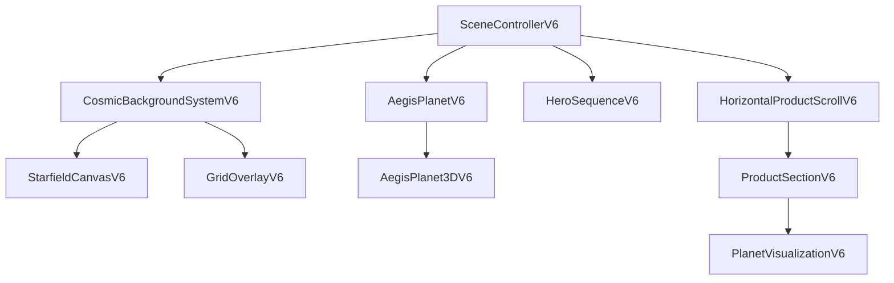

# CuriousLabs V6 Implementation Guide for Cursor

## 🚀 Build Plan & Implementation Strategy

This document outlines the step-by-step approach for building the CuriousLabs V6 website using Cursor. Follow this structured implementation plan to ensure components are developed with proper dependencies and performance considerations.

## 📁 Project Structure

```
/src/
├─ components/
│  └─ home/
│     └─ v6/
│        ├─ SceneControllerV6.jsx       # Phase 1: Core controller
│        ├─ StarfieldCanvasV6.jsx       # Phase 2: Background
│        ├─ GridOverlayV6.jsx           # Phase 2: Background
│        ├─ CosmicBackgroundSystemV6.jsx # Phase 2: Background
│        ├─ AegisPlanet3DV6.jsx         # Phase 3: Hero elements
│        ├─ AegisPlanetV6.jsx           # Phase 3: Hero elements
│        ├─ HeroSequenceV6.jsx          # Phase 3: Hero elements
│        ├─ PlanetVisualizationV6.jsx   # Phase 4: Product elements
│        ├─ ProductSectionV6.jsx        # Phase 4: Product elements 
│        └─ HorizontalProductScrollV6.jsx # Phase 4: Product elements
├─ hooks/
│  ├─ useBreakpoint.js                  # Utility hook
│  └─ useScrollTrigger.js               # Utility hook
├─ styles/
│  └─ globals.css                       # Global styles
├─ pages/
│  └─ index.jsx                         # Main entry point
└─ tailwind.config.js                   # Tailwind configuration
```

## 🧩 Component Dependencies



## 🔄 Implementation Phases

### Phase 1: Core Foundation (Days 1-2)

#### 1.1 Project Setup

```bash
# In Cursor, create a new Next.js project
npx create-next-app@latest curiouslabs-v6
cd curiouslabs-v6

# Install dependencies
npm install tailwindcss postcss autoprefixer
npm install framer-motion
npm install @react-three/fiber @react-three/drei three
npm install @react-spring/three

# Initialize Tailwind CSS
npx tailwindcss init -p
```

#### 1.2 Configure Tailwind

Update `tailwind.config.js` with custom extensions:

```javascript
// In Cursor, prompt:
// "Help me update the tailwind.config.js file to include custom box shadows for glow effects, 
// custom keyframes for animations, and custom animation definitions"
```

#### 1.3 Create Scene Controller

```javascript
// In Cursor, prompt:
// "Create SceneControllerV6.jsx component that follows the LEGIT protocol, 
// with scene phase management, device capability detection, and context provider"
```

### Phase 2: Background System (Days 3-4)

#### 2.1 Create Starfield Canvas

```javascript
// In Cursor, prompt:
// "Create StarfieldCanvasV6.jsx component that uses canvas to draw a performance-optimized 
// starfield with different densities based on device capabilities"
```

#### 2.2 Create Grid Overlay

```javascript
// In Cursor, prompt:
// "Create GridOverlayV6.jsx component that draws a subtle perspective grid 
// with different densities based on performance tier"
```

#### 2.3 Integrate Background System

```javascript
// In Cursor, prompt:
// "Create CosmicBackgroundSystemV6.jsx component that manages all background layers 
// including gradient, starfield, nebula imagery and grid overlay"
```

### Phase 3: Hero Section (Days 5-7)

#### 3.1 Create 3D Planet

```javascript
// In Cursor, prompt:
// "Create AegisPlanet3DV6.jsx using React Three Fiber to render a 3D planet with 
// distortion material, atmospheric glow, and orbital rings"
```

#### 3.2 Create Adaptive Planet Component

```javascript
// In Cursor, prompt:
// "Create AegisPlanetV6.jsx that provides both 3D implementation and 
// CSS/SVG fallback based on device capabilities"
```

#### 3.3 Create Hero Sequence

```javascript
// In Cursor, prompt:
// "Create HeroSequenceV6.jsx that orchestrates all hero section elements, 
// including logo, planet visualization, animated headline, and CTA"
```

### Phase 4: Product Showcase (Days 8-10)

#### 4.1 Create Planet Visualizations for Products

```javascript
// In Cursor, prompt:
// "Create PlanetVisualizationV6.jsx that renders product-specific planets 
// with unique patterns and orbital features"
```

#### 4.2 Create Product Section

```javascript
// In Cursor, prompt:
// "Create ProductSectionV6.jsx with alternating layout based on Z-pattern flow, 
// featuring animated text reveals and feature bullets"
```

#### 4.3 Implement Horizontal Scroll

```javascript
// In Cursor, prompt:
// "Create HorizontalProductScrollV6.jsx with snap scrolling, navigation indicators, 
// and product sequence management"
```

### Phase 5: Integration & Testing (Days 11-12)

#### 5.1 Create Main Page

```javascript
// In Cursor, prompt:
// "Create the index.jsx page that combines all components into a complete experience 
// with proper metadata and structure"
```

#### 5.2 Perform Testing & Optimization

```javascript
// In Cursor, prompt:
// "Help me create a test protocol for validating all components across different device types, 
// performance tiers, and user preferences"
```

## 🛠️ Build Strategy for Cursor

### Using Cursor Effectively

1. **Context Preparation**
   - Begin each component implementation by providing Cursor with the specific requirements and dependencies
   - Reference LEGIT protocol and performance considerations
   - Include relevant component relationships

2. **Incremental Code Generation**
   - Use multi-step prompts rather than requesting entire files at once
   - Review and adjust code blocks before proceeding to the next section

3. **Thoughtful Iteration**
   - After implementing each component, ask Cursor to suggest improvements
   - Focus on performance optimization, accessibility, and edge cases

### Example Cursor Workflow

```
1. Open a new file in Cursor
2. Set the context: "I'm implementing the SceneControllerV6.jsx component according to the LEGIT protocol"
3. Ask for skeleton: "Help me create the basic structure for this component"
4. Request specific implementation: "Now implement the device capability detection logic"
5. Iterate: "Let's improve the performance tier determination logic"
6. Add documentation: "Add proper LEGIT metadata and comments"
7. Repeat for each component
```

## 🧪 Testing Approach

### Performance Testing

1. **Simulated Device Testing**
   - Create performance profiles for different device types
   - Test all components with each profile
   - Verify fallback mechanisms activate correctly

2. **Frame Rate Monitoring**
   - Implement FPS counter during development
   - Ensure animations maintain at least 30fps on low-end devices
   - Target 60fps on high-performance devices

### Accessibility Testing

1. **Reduced Motion Testing**
   - Test with `prefers-reduced-motion: reduce` media query
   - Verify all animations are properly disabled
   - Ensure content is still accessible

2. **Screen Reader Testing**
   - Test with VoiceOver, NVDA, or other screen readers
   - Verify all important content has proper ARIA attributes
   - Ensure decorative elements are properly hidden

## 💯 Quality Assurance Checklist

Each component must pass these checks before being integrated:

- [ ] Follows LEGIT protocol with proper metadata
- [ ] Has performance-tiered implementations
- [ ] Properly responds to device capabilities
- [ ] Handles reduced motion preferences
- [ ] Maintains responsive layout
- [ ] Has appropriate fallbacks
- [ ] Includes proper documentation
- [ ] No console errors

## 🔄 Using This Document in Cursor

When implementing each component in Cursor, reference the specific phase and component in this document:

```
I'm working on Phase 2.1 from the CuriousLabs V6 Implementation Guide. 
I'm creating the StarfieldCanvasV6.jsx component. 
It should follow the LEGIT protocol with metadata, respond to performance tiers, 
and have proper canvas optimization.
```

This structured approach ensures consistent implementation across all components while leveraging Cursor's capabilities for efficient development.